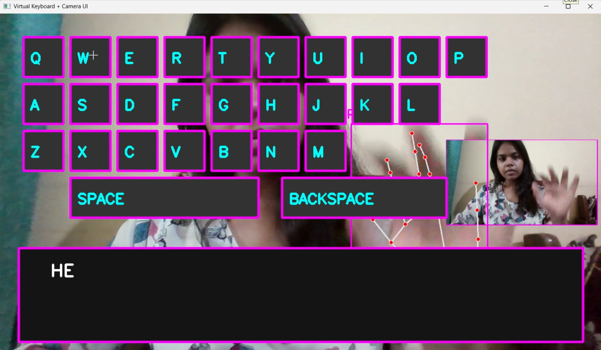

## Virtual Keyboard using OpenCV & MediaPipe 

A futuristic hand-gesture controlled virtual keyboard built using OpenCV, MediaPipe, and cvzone.
This project detects hand movements in real time using a webcam and allows users to type using finger gestures.

## About The Project

This virtual keyboard uses computer vision and hand tracking to create a touchless typing experience.

Using MediaPipe hand landmarks and OpenCV image processing, the system detects finger positions and simulates keyboard interactions through gestures.

The project features:

* Real-time hand tracking
* Gesture-based key press detection
* Neon cyberpunk themed keyboard UI
* Spacebar and backspace support
* Multi-line text display
* Hover and click animations
* Typing cooldown for smoother interaction

---
## Preview



## Demo Video

Download and watch: `virtual_keyboard.mp4`

## Built With

* Python
* OpenCV
* MediaPipe
* cvzone
* pynput

---

## Getting Started

### Prerequisites

Make sure Python 3.11+ is installed.

Check version:

```bash
python --version
```

---

## Installation

### 1. Clone the repository

```bash
git clone https://github.com/crox0000/VirtualKeyboard.git
```

---

### 2. Navigate into project folder

```bash
cd VirtualKeyboard
```

---

### 3. Create virtual environment

```bash
python -m venv venv
```

---

### 4. Activate virtual environment

#### Windows

```bash
venv\Scripts\activate
```

---

### 5. Install dependencies

```bash
pip install opencv-python
pip install mediapipe==0.10.9
pip install cvzone
pip install pynput
```

---

## Usage

Run the project using:

```bash
python virtual_keyboard.py
```

---

## Controls

| Gesture                              | Action           |
| ------------------------------------ | ---------------- |
| Move Index Finger                    | Hover over key   |
| Bring thumb + Index  Finger Together | Press key        |
| Press `q`                            | Exit application |

---

## How It Works

1. Webcam captures live video feed.
2. MediaPipe detects hand landmarks.
3. cvzone simplifies hand tracking functions.
4. Distance between fingers is calculated.
5. A key press is detected when fingers come close together.
6. Typed text appears in the textbox.

---

## Project Structure

```text
VirtualKeyboard/
│
├── venv/
├── virtual_keyboard.py
├── README.md
```

---

## Roadmap

* [ ] Add sound effects
* [ ] AI autocorrect
* [ ] Dark/Light mode
* [ ] Emoji keyboard
* [ ] Swipe typing
* [ ] Gesture shortcuts
* [ ] Voice typing integration

---

## Future Improvements

Potential future upgrades:

* Finger tracking smoothing
* Multi-hand support
* Mobile camera integration
* AI-powered predictive typing
* Eye tracking support

---

## Contributing

Contributions, suggestions, and improvements are welcome.

## License

Distributed under the MIT License.

## Acknowledgments

* OpenCV Documentation
* MediaPipe by Google
* cvzone library
* Computer Vision community

---

## Author

Built with Python, OpenCV, and curiosity 


